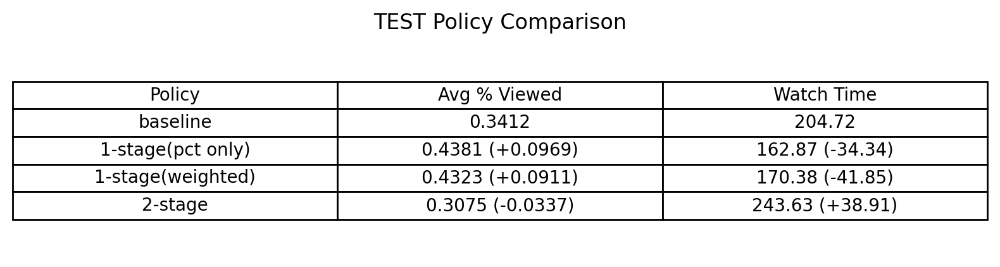
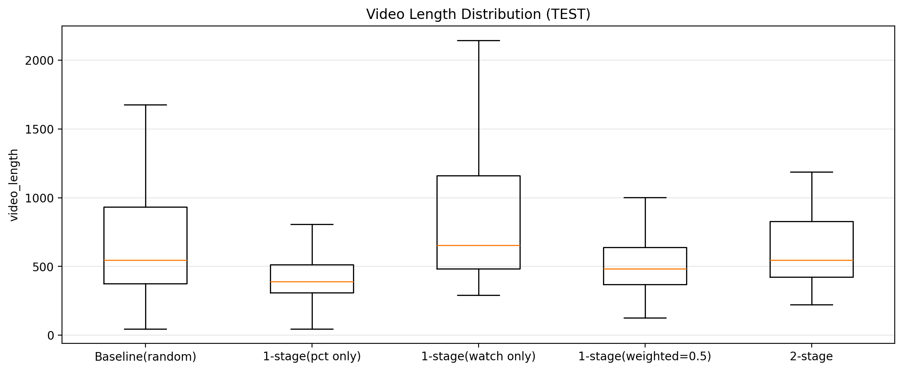

# YouTube Engagement Recommender  
**Next-Day KPI Forecasting + Ranking Policy Simulator (Offline)**

This project builds an **offline policy simulator** for selecting a daily **Top-K slate** of videos to maximize **next-day engagement** on **YouTube**.

Key point: **prediction is not the end goal — ranking policy is.**  
A “good” model can still produce a bad product outcome if the **ranking objective is misaligned**.

---

## 1) Problem Definition

Each day we make a product decision:

- On day *t*, choose **K videos** to promote (the “slate”).
- Evaluate engagement on day *t+1* using **next-day outcomes**.

### Targets (Next-Day KPIs)

We model two KPIs:

- **Primary:** `y_next_avg_pct_viewed`  
  Average fraction watched on the next day (completion depth).

- **Secondary:** `y_next_watch_time_log`  
  Next-day watch time modeled in log space for stability.

When reporting watch time in real units, we invert the log transform:

- `watch_time_real = expm1(y_next_watch_time_log)` (i.e., `np.expm1()`)

---

## 2) Data & Features

- **Unit of observation:** (video, date)
- **Features:** daily views, likes/dislikes, comments, subs change, video length, etc.
- **Prediction goal:** estimate next-day KPIs for each (video, day)

**Important intuition:** some policies heavily prefer short videos (higher completion %) even if they reduce total watch time — this is where the KPI trade-off appears.

---

## 3) Method Overview

### Step A — Forecast Next-Day KPIs
Train regression models to produce:

- `pred_pct` → predicted `y_next_avg_pct_viewed`
- `pred_watch_log` → predicted `y_next_watch_time_log`

### Step B — Policy Simulator (Daily Top-K Slate)
For each day, rank candidates by a policy rule and take **Top-K**.

We compare multiple ranking policies (below).

---

## 4) Ranking Policies Compared

### P0 — Random Baseline (No Model)
Randomly pick **K videos per day**.  
This is the **true baseline** for uplift comparisons.

### P1 — 1-Stage (Pct-Only)
Rank by `pred_pct` per day → take Top-K.  
Expected: **↑ % viewed**, often **↓ watch time** (over-selects short/easy-to-finish videos).

### P2 — 1-Stage (Watch-Only)
Rank by `pred_watch_log` per day → take Top-K.  
Expected: **↑ watch time**, often **↓ % viewed** (selects longer videos).

### P3 — 1-Stage Balanced Weighted Score ✅ (Selected on VALID)
Combine standardized predictions into one score:

- `score = w_pct * z(pred_pct) + (1 - w_pct) * z(pred_watch_log)`

Rank by `score` per day → take Top-K.

We tune `w_pct` on **VALID**, then lock it for **TEST**.  
**Selected:** `w_pct = 0.50` (balanced trade-off).

### P4 — 2-Stage (Pct → Watch)
Two-step ranking:

1. **Stage 1 (candidate generation):** take Top-N by `pred_pct`
2. **Stage 2 (final slate):** rerank those N by `pred_watch_log` and take Top-K

`N` is tuned on **VALID** (e.g., `N=150`) and then fixed for **TEST**.

---

## 5) Results (TEST)

### 5.1 Policy Comparison Table (TEST)


### 5.2 KPI Levels on TEST
These plots show absolute KPI values under each policy:


### 5.3 Uplift vs Random Baseline (TEST)
Uplift is computed relative to the **random baseline**:


### 5.4 Video Length Distribution (TEST)
This helps explain *why* the KPI trade-off happens:



---

## 6) Interpretation (Key Takeaways)

### Trade-off is real (and policy-driven)
Even if KPIs are positively correlated overall, **ranking creates selection bias**:

- Optimizing **% viewed** tends to favor **shorter** videos  
  → higher completion fraction, but fewer total minutes watched.
- Optimizing **watch time** tends to favor **longer** videos  
  → more minutes watched, but lower completion fraction.

### What the policies show on TEST
- **Pct-only (P1)**: strong improvement in **% viewed**, but a large drop in **watch time**.  
  *Interpretation:* completion optimizer → selects shorter videos.

- **Watch-only (P2)**: large improvement in **watch time**, but lower **% viewed**.  
  *Interpretation:* watch-time optimizer → selects longer videos.

- **Balanced weighted (P3, w_pct=0.50)**: a **middle ground** — improves **% viewed** while keeping watch time close to baseline.  
  *Interpretation:* explicitly manages the KPI trade-off rather than optimizing one KPI blindly.

- **2-stage (P4)**: small positive gain in **% viewed** with a meaningful gain in **watch time**.  
  *Interpretation:* “completion-gated watch optimization” — keeps reasonable completion while improving minutes watched.

---

## 7) Limitations & Future Improvements

### Limitations
- **Offline evaluation only:** results come from a replay-style simulator, not an online A/B test.
- **No causal guarantees:** improvements may not transfer to production due to position bias, feedback loops, and changing user behavior.
- **Two-KPI objective:** we optimize engagement KPIs, not a direct business metric (e.g., revenue, retention, subscriptions).
- **Simplified slate setting:** assumes a fixed Top-K per day and ignores constraints (freshness, diversity, creator fairness, safety).
- **Model uncertainty not used:** policies rank by point predictions only (no confidence intervals / uncertainty-aware ranking).

### Future Improvements
- Add **uncertainty-aware ranking** (e.g., penalize high-variance predictions, or use conservative estimates).
- Add **constraints** (minimum diversity, creator caps, freshness, and content safety filters).
- Extend evaluation to **more KPIs** (CTR, likes/comments, retention proxies) or a **single business objective** if available.
- Try **Pareto frontier / constrained optimization** instead of a fixed weighted sum.
- Run a **robustness check** across multiple random seeds and different time windows.

---

## 8) Reproduce

From the repo root:

```bash
pip install -r requirements.txt
jupyter notebook notebooks/00_load_clean.ipynb
jupyter notebook notebooks/01_model_and_policy.ipynb
```

---

## 9) Repo Structure

```bash
youtube-trending-recommender/
├─ notebooks/
│  ├─ 00_load_clean.ipynb
│  └─ 01_model_and_policy.ipynb
├─ reports/
│  ├─ figures/     # plots rendered in README
│  └─ tables/      # csv/md summary tables (optional)
├─ src/            # (optional) reusable code
├─ requirements.txt
└─ README.md
```
