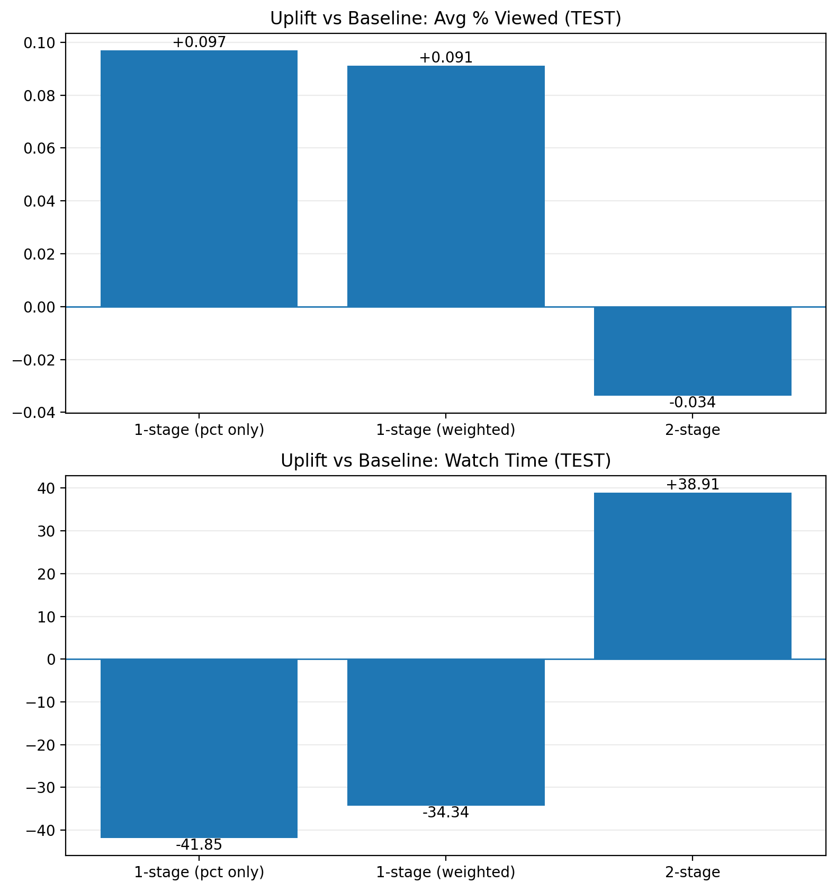

# YouTube Engagement Recommender  
### Next-Day KPI Forecasting + Ranking Policy Simulator

This project builds an **offline recommender-policy simulator** that selects a daily **Top-K slate** of videos to optimize **next-day engagement**.  
We model two KPIs (completion depth and total watch time), then compare multiple ranking policies—including a **balanced weighted policy** that explicitly manages KPI trade-offs.

> **Core idea:** prediction is not the end goal—**ranking policy** is.  
> A good model can still produce a bad product outcome if the ranking objective is misaligned.

---

## 1) Problem Definition

Each day we make a product decision:

- On **day _t_**, choose **K videos** to promote (the “slate”)
- Evaluate performance on **day _t+1_** using next-day outcomes

### Targets (Next-Day KPIs)
- **Primary:** `y_next_avg_pct_viewed`  
  *Average % of the video watched on the next day (depth/completion).*
- **Secondary:** `y_next_watch_time_log`  
  *Next-day watch time, modeled in log space for stability.*

When reporting watch time in real units, we invert the log transform with:
- `watch_time_real = expm1(y_next_watch_time_log)` (i.e., `np.expm1`)

---

## 2) Data & Features ✅ (edit as needed)

**Unit of observation:** (video, date)  
**Features include:** daily views, likes/dislikes, comments, subs change, video length, etc.  
**Prediction goal:** estimate next-day engagement metrics for each (video, day).

> Note: some policies heavily prefer **short videos** (higher completion %) even if they reduce total watch time. This is a key reason the KPI trade-off appears.

---

## 3) Method Overview

### Step A — Forecast Next-Day KPIs
We fit regression models to produce:
- `pred_pct` = predicted `y_next_avg_pct_viewed`
- `pred_watch_log` = predicted `y_next_watch_time_log`

### Step B — Policy Simulator (Daily Top-K Slate)
For each day, we rank candidates and take the **Top-K**.  
We compare the policies below.

---

## 4) Ranking Policies Compared

### (P0) Random Slate (sanity baseline)
Sample K items per day to confirm uplift ≈ 0.

### (P1) 1-Stage: Pct-Only
Rank by `pred_pct` per day → pick Top-K.

**Typical behavior:**  
Improves completion depth (% viewed), but often selects shorter videos → watch time can drop.

### (P2) 2-Stage: Pct → Watch
Stage 1: per day, keep top **N candidates** by `pred_pct`  
Stage 2: within those candidates, rank by `pred_watch_log` → pick Top-K

**Typical behavior:**  
Pushes watch time up, but may sacrifice completion depth.

### (P3) 1-Stage: Balanced Weighted Score ✅ recommended
Compute a single score from standardized predictions:
\[
score = w_{pct}\cdot z(pred\_pct)\;+\;(1-w_{pct})\cdot z(pred\_watch\_log)
\]
Rank by `score` per day → pick Top-K.

**Why z-scores?**  
Because `% viewed` and `watch_time_log` live on different scales—z-scoring makes weights interpretable.

---

## 5) Offline Evaluation Protocol

For each split (VALID / TEST):

1. **Baseline:** average KPI across *all* videos in that split  
2. **Slate KPI:** average KPI within the selected Top-K slates  
3. **Uplift:** `slate_mean − baseline_mean`

We evaluate both:
- `y_next_avg_pct_viewed` (higher is better)
- `expm1(y_next_watch_time_log)` (higher is better, in real units)

Outputs are saved in:
- `reports/tables/policy_comparison.csv`
- `reports/tables/policy_comparison.md`

---

## 6) Results (Key Takeaways)

- 📓 End-to-end notebook: [notebooks/00_end_to_end.ipynb](notebooks/00_end_to_end.ipynb)
- 📊 Policy comparison (Markdown): [reports/tables/policy_comparison.md](reports/tables/policy_comparison.md)
- 📄 Policy comparison (CSV): [reports/tables/policy_comparison.csv](reports/tables/policy_comparison.csv)

---

## Key Figures (TEST)

### KPI levels (Avg % Viewed + Watch Time)
<p align="center">
  
</p>

### KPI uplift vs baseline
<p align="center">
  
</p>

### Policy comparison
<p align="center">
  
</p>


## What the Results Mean

- **Pct-only policy (P1)** increases **completion depth** (% viewed) but reduces **total watch time**.  
  *Interpretation:* it over-selects shorter videos that are easier to finish.

- **2-stage policy (P2: pct → watch)** increases **watch time** but reduces **% viewed**.  
  *Interpretation:* it shifts toward longer videos, raising minutes watched but lowering completion fraction.

- **Balanced weighted policy (P3)** targets a **middle ground** by tuning `w_pct` (VALID) and evaluating on TEST.  
  *Goal:* avoid both extremes (pure completion optimizer vs pure watch-time maximizer).

  
---

## 7) Why This Trade-Off Happens (Intuition)

Even when KPIs are positively correlated overall, **ranking introduces selection bias**:

- Maximizing `% viewed` tends to favor **shorter videos**  
  → higher completion fraction, but lower total minutes watched.
- Maximizing watch time tends to favor **longer videos**  
  → higher minutes, but lower completion fraction.

A good ranking policy must either:
- **explicitly optimize one KPI**, or
- **combine KPIs** (weighted score / constraints / Pareto frontier).

---

## 8) Repo Structure

```text
youtube-trending-recommender/
├── notebooks/
│   └── 00_end_to_end.ipynb
├── reports/
│   ├── figures/                  # plots rendered in README
│   └── tables/                   # csv/md summary tables
├── src/                          # (optional) reusable code
└── README.md
